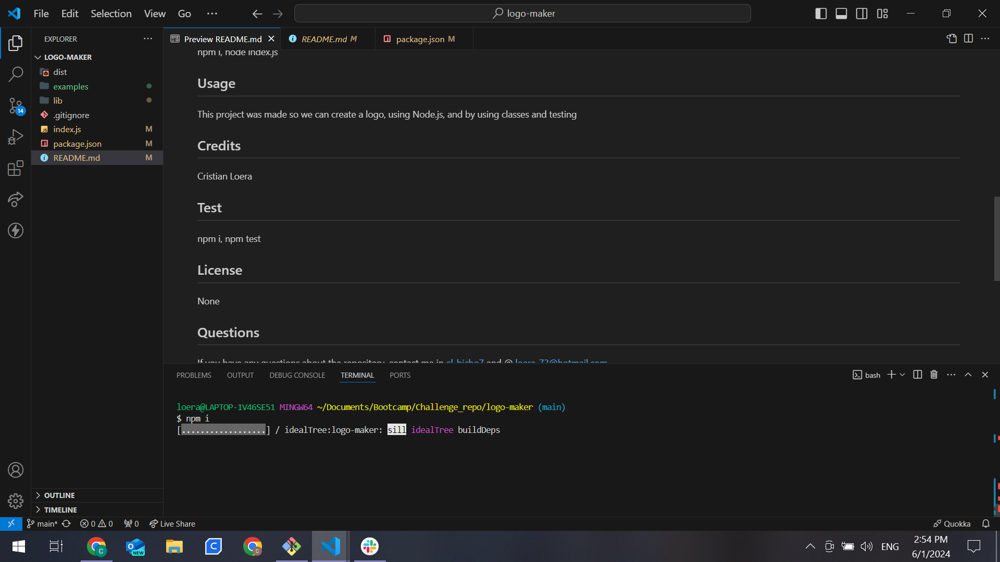
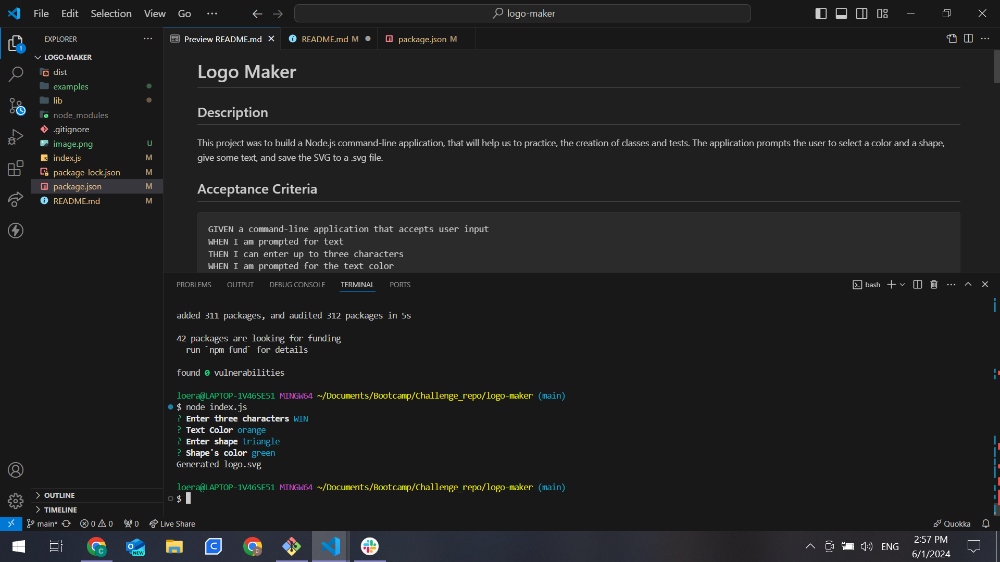
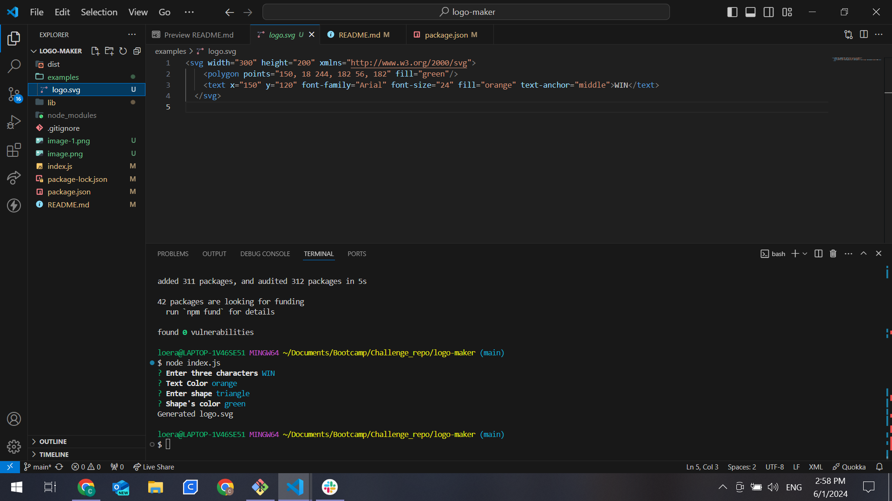
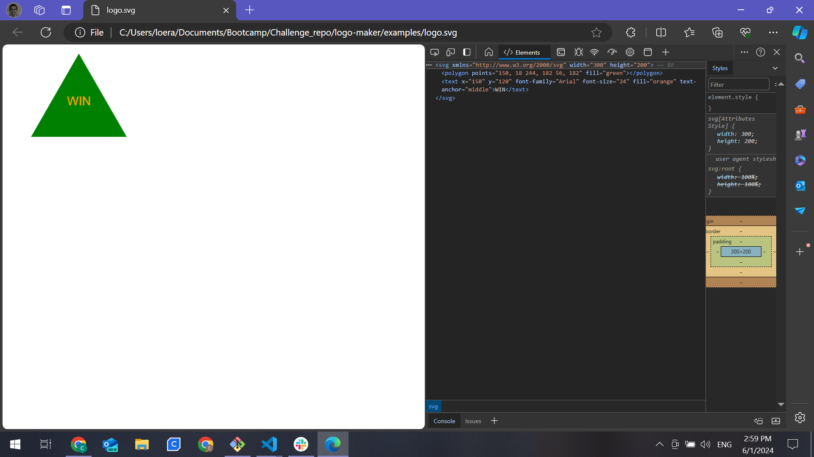
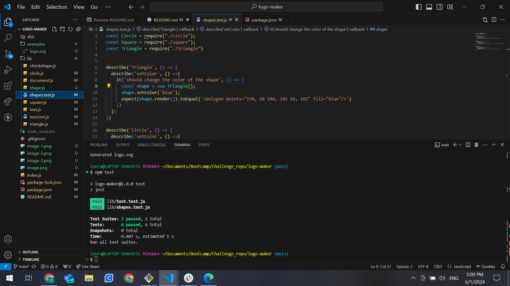

  # Logo Maker  

  ## Description 
  This project was to build a Node.js command-line application, that will help us to practice, the creation of classes and tests. The application prompts the user to select a color and a shape, give some text, and save the SVG to a .svg file.

  ## Acceptance Criteria

  ```md
GIVEN a command-line application that accepts user input
WHEN I am prompted for text
THEN I can enter up to three characters
WHEN I am prompted for the text color
THEN I can enter a color keyword (OR a hexadecimal number)
WHEN I am prompted for a shape
THEN I am presented with a list of shapes to choose from: circle, triangle, and square
WHEN I am prompted for the shape's color
THEN I can enter a color keyword (OR a hexadecimal number)
WHEN I have entered input for all the prompts
THEN an SVG file is created named `logo.svg`
AND the output text "Generated logo.svg" is printed in the command line
WHEN I open the `logo.svg` file in a browser
THEN I am shown a 300x200 pixel image that matches the criteria I entered
```

  ## Table of Contents 
  - [Installation](#installation)
  - [Usage](#usage)
  - [Contributing](#contributing)
  - [Test](#test)
  - [License](#license)
  - [Questions](#questions)

  ## Installation 
  npm i, node index.js

  ## Usage
  This project was made so we can create a logo, using Node.js, and by using classes and testing.

  

  

  

  

  ## Credits
  Cristian Loera

  ## Test
  npm i, npm test

 

  ## License
  None
  

  ## Questions
  If you have any questions about the repository, contact me in [el-bicho7](https://github.com/el-bicho7) and @ loera_73@hotmail.com
 
  